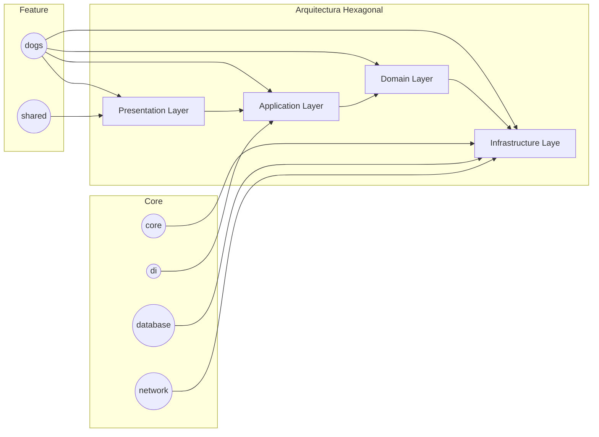

# Android App: Dogs List (Arquitectura Limpia, Modular y DDD)

Este proyecto es una aplicación Android que muestra una lista de perros, implementada con una arquitectura limpia, modular y siguiendo los principios de Domain-Driven Design (DDD). El objetivo principal es demostrar una estructura de código mantenible, escalable y testeable.

## Arquitectura

La aplicación sigue una arquitectura hexagonal combinada con DDD para separar las responsabilidades y facilitar la evolución del software.

### Diagrama de Módulos y Capas (Mermaid)

## Módulos

El proyecto está dividido en los siguientes módulos:

1. Core:
Contiene clases base y utilidades comunes utilizadas en toda la aplicación.

* core:
Clases base como Resource (para manejar el estado de las operaciones asíncronas), extensiones, converters, etc.
Cualquier código reutilizable que no pertenezca a un módulo específico.

* di:
Un sistema de inyección de dependencias (DI) propio y simple.
Permite registrar y resolver dependencias en toda la aplicación.
Facilita la testabilidad y la modularidad.

* database:
Contiene la conexión a la base de datos Room.
Define las entidades (data classes) que representan los datos en la base de datos.
Define los DAOs (Data Access Objects) que permiten acceder y modificar los datos en la base de datos.
* network:
Contiene las llamadas a las APIs utilizando Retrofit.
Define las interfaces que representan los endpoints de la API.
Define los modelos de datos (DTOs) que representan los datos recibidos de la API.

2) Feature
Contiene los módulos que implementan las funcionalidades específicas de la aplicación.

* dogs:
Implementa la funcionalidad para mostrar una lista de perros.
Sigue una arquitectura DDD:
**domain**: Contiene las entidades (Dog), los casos de uso (GetAllDogsUseCase, etc.) y las interfaces (DogRepository).
**data**: Contiene las implementaciones de las interfaces (ej: DogRepositoryImpl), los mappers (para convertir entre DTOs y entidades) y los clientes de la API y la base de datos.
**presentation**: Contiene los ViewModels y los Composables que muestran la lista de perros.
Permite la reutilización y el testeo independiente de cada capa.
* shared:
Contiene Composables reutilizables que se pueden usar en cualquier parte de la aplicación.
No sigue una arquitectura DDD, ya que solo contiene componentes de UI.
Ejemplos: Local, LoadingIndicator, ErrorView, etc.